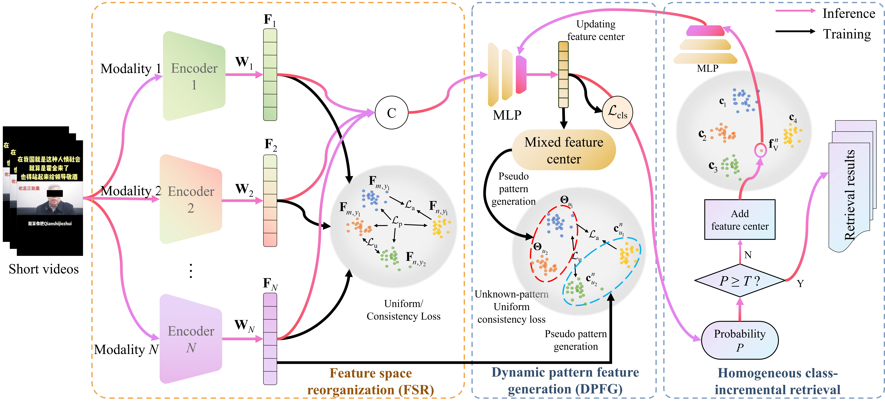

# FSR-CIR: Reorganizing the Multimodal Feature Space for Class-Incremental Retrieval of Homogeneous Videos

FSR-CIR is a multimodal class-incremental retrieval framework for homogeneous videos. By reorganizing the feature space,
it mitigates semantic overlap between old and new classes and supports the continual incorporation of emerging video
categories.

The dataset is available for non-commercial research purposes only. All copyrights of the images and multimedia
resources remain with their original owners. Access to the dataset requires a signed data license agreement. Please
contact the corresponding author via email for further information.

The associated paper is under review. The source code is currently being prepared.
